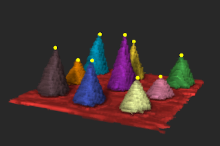

# PRO-TIP: Automatic Ultrasound Calibration
This repository contains a reference open source implementation of the paper [PRO-TIP: Phantom for RObust automatic
ultrasound calibration by TIP detection (Ronchetti et al. 2022)](https://arxiv.org/abs/2206.05962) as an ImFusionSuite plugin.

**NOTE** The algorithm is also part of the ImFusion SDK.




## 3D Printing of the phantom
The 3D model of the phantom used in the paper is located in [phantom/phantom.obj](https://github.com/ImFusionGmbH/PRO-TIP-Automatic-Ultrasound-Calibration/raw/master/phantom/phantom.obj). The OBJ file can be sliced using the software provided by a 3D printer and printed.   

## Wire Phantom Experiments
Description of the experiments with the wire phantom and results can be found in [this repository](https://github.com/mariatirindelli/WirePhantomCalibration).

## Build instructions
### Linux
```
cd ConeCalibrationPlugin/
mkdir build
cd build
cmake ..
make
``` 